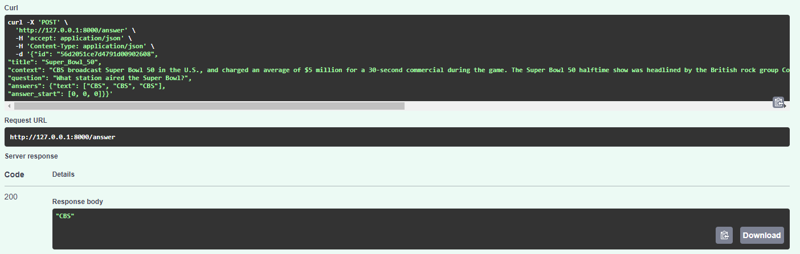
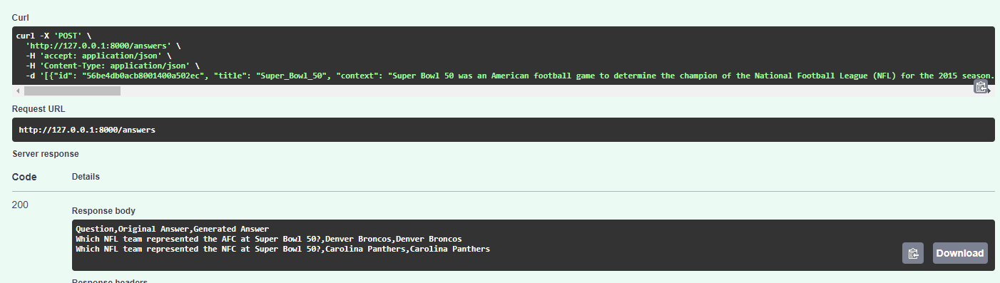
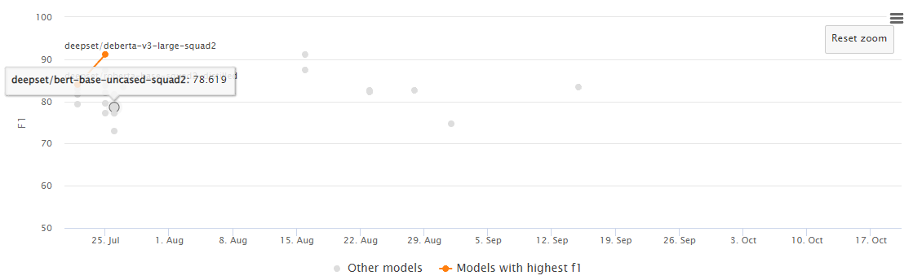

# Question-Answering system using BERT-based models and FastAPI

# Table of Contents
- [Question-Answering system using BERT-based models and FastAPI](#question-answering-system-using-bert-based-models-and-fastapi)
  - [Description](#description)
  - [Installation](#installation)
  - [Usage](#usage)
  - [API Documentation](#api-documentation)
  - [Examples](#examples)
    - [/answer](#answer)
    - [/answers](#answers)
  - [Model used](#model-used)
    - [model explanation](#model-explanation)

## Description

This is a question-answering system that uses BERT-based models and FastAPI. The system allows users to ask questions and get answers from a given text. The
system is built using FastAPI and the models are built using the Hugging Face library.

## Installation

To install the project, you need to clone the repository and install the dependencies.
to clone the repository, run the following command:

```bash 
git clone https://github.com/Amir-Seif-Mohamed/Question-Answering_system.git
```

If you don't have poetry, you can install it using the following command:

```bash
pip install poetry
```

To install the dependencies, run the following command:

Note: If you want to create the virtual environment, within the project directory, run the following command:

```bash
poetry config virtualenvs.in-project true
```
"make sure you have 3.10 python version for torch to work"

then run the following command to install the dependencies:

```bash
poetry install
```


## Usage

to run the project, in terminal locate the directory of the main.py file and run the following command:

```bash
uvicorn main:app --reload
```
Then you can interact with API though this url:  http://http://127.0.0.1:8000/docs

## API Documentation
There are two endpoints in the API:
1. /answer
2. /answers

| API      | Input | Output     |
| ---------|:-----:| ----------:|
| /answer  | Json  | string     |
| /answers | Json  | csv file   |


To get the answer for a single question, you can use the /answer endpoint. The endpoint takes a json object with the following format:
```json
{
  "question": "string",
  "context": "string"
}
```
To get the answer for multiple questions, you can use the /answers endpoint. The endpoint takes a json object with the following format:
```json
[{
  "question": "string",
  "context": "string",
  "answers": {} | null
}]
```
## Examples

### /answer
```json
{"id": "56d2051ce7d4791d00902608", 
"title": "Super_Bowl_50", 
"context": "CBS broadcast Super Bowl 50 in the U.S., and charged an average of $5 million for a 30-second commercial during the game. The Super Bowl 50 halftime show was headlined by the British rock group Coldplay with special guest performers Beyoncé and Bruno Mars, who headlined the Super Bowl XLVII and Super Bowl XLVIII halftime shows, respectively. It was the third-most watched U.S. broadcast ever.", 
"question": "What station aired the Super Bowl?", 
"answers": {"text": ["CBS", "CBS", "CBS"], 
"answer_start": [0, 0, 0]}}
```

Response:
```json
"CBS"
```

### /answers
```json
[{"id": "56be4db0acb8001400a502ec", "title": "Super_Bowl_50", "context": "Super Bowl 50 was an American football game to determine the champion of the National Football League (NFL) for the 2015 season. The American Football Conference (AFC) champion Denver Broncos defeated the National Football Conference (NFC) champion Carolina Panthers 24–10 to earn their third Super Bowl title. The game was played on February 7, 2016, at Levi's Stadium in the San Francisco Bay Area at Santa Clara, California. As this was the 50th Super Bowl, the league emphasized the golden anniversary with various gold-themed initiatives, as well as temporarily suspending the tradition of naming each Super Bowl game with Roman numerals (under which the game would have been known as Super Bowl L), so that the logo could prominently feature the Arabic numerals 50.", "question": "Which NFL team represented the AFC at Super Bowl 50?", "answers": {"text": ["Denver Broncos", "Denver Broncos", "Denver Broncos"], "answer_start": [177, 177, 177]}},{"id": "56be4db0acb8001400a502ed", "title": "Super_Bowl_50", "context": "Super Bowl 50 was an American football game to determine the champion of the National Football League (NFL) for the 2015 season. The American Football Conference (AFC) champion Denver Broncos defeated the National Football Conference (NFC) champion Carolina Panthers 24–10 to earn their third Super Bowl title. The game was played on February 7, 2016, at Levi's Stadium in the San Francisco Bay Area at Santa Clara, California. As this was the 50th Super Bowl, the league emphasized the golden anniversary with various gold-themed initiatives, as well as temporarily suspending the tradition of naming each Super Bowl game with Roman numerals (under which the game would have been known as Super Bowl L), so that the logo could prominently feature the Arabic numerals 50.", "question": "Which NFL team represented the NFC at Super Bowl 50?", "answers": {"text": ["Carolina Panthers", "Carolina Panthers", "Carolina Panthers"], "answer_start": [249, 249, 249]}}]
```
Response:
```csv
Question,Original Answer,Generated Answer
Which NFL team represented the AFC at Super Bowl 50?,Denver Broncos,Denver Broncos
Which NFL team represented the NFC at Super Bowl 50?,Carolina Panthers,Carolina Panthers
```

## Model used
The model used is the bert-base-uncased-squad2 model.

### model explanation
The model is a fine-tuned from Bidirectional Encoding Representations for Transformers aka BERT model that is trained on the SQuAD version 2.0 dataset with case insensitive. The model is trained to answer questions based on a given context utilizing the key concept of transformers which is self-attention. The following chart shows the f1 score of the model vs other models on the SQuAD 2.0 dataset. 



credits to [Papers with code](https://paperswithcode.com/sota/question-answering-on-squad-v2) for the chart.
